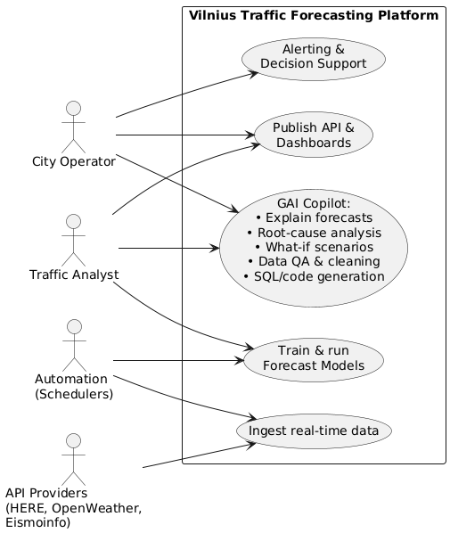
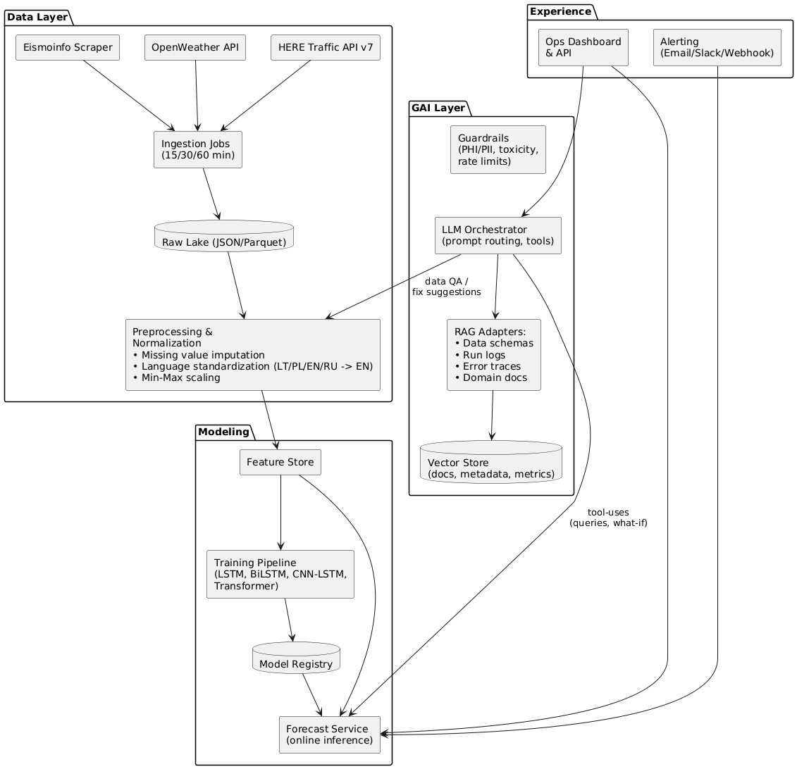
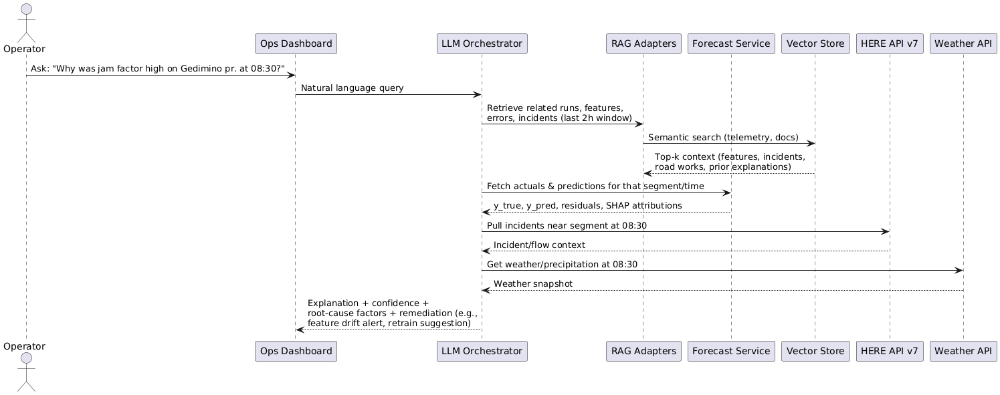
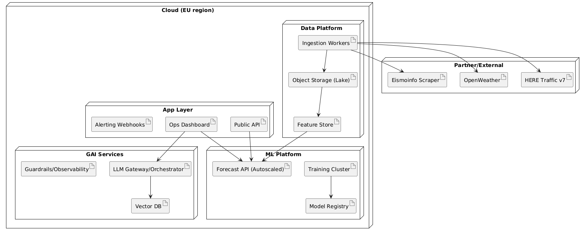

## Task

Find the company that best suits your final project solution. Draw UML diagrams ( with PlantUML and some LLM ) that show how GAI is integrated into your product that you are developing in your thesis.

## 🏢 Company Best Suited for the Solution

### **HERE Technologies** — *Primary Partner*

**Reasons:**
- The platform already relies on **HERE Traffic API v7** for real-time traffic flow and jam factor data.
- HERE provides **historical and predictive traffic datasets**, which are essential for training and benchmarking.
- Integration with HERE’s ecosystem (Routing, Map Tiles, Incidents) could extend this project toward a full **smart mobility decision system**.

**Additional Collaboration Opportunities:**
- **Trafi :** Vilnius-born MaaS platform with city deployments and mobility intelligence; useful for fusing public transport demand with road traffic insights.
- **TomTom:** alternative/backup traffic data and Traffic Index benchmarks; Lithuania (including Vilnius) is covered by TomTom traffic products.
- **Vilnius Traffic Management Centre (JUDU):** ideal municipal stakeholder and deployment venue for decision support dashboards.

## Use Case Diagram

## Component Diagram

## Sequence Diagram

## Deployment Diagram

## Task
Conceptualize your thesis system as an end-to-end solution implemented by a single AI agent. This agent receives input data X, processes it through all stages of your pipeline (data understanding, inference, reasoning, and output generation), and returns the predicted or generated result y.

## end-to-end solution implemented by a single AI agent
